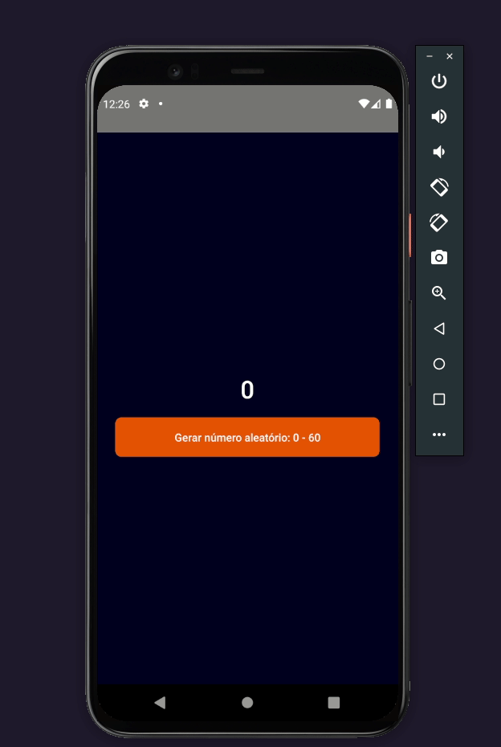

# Gerador de número aleatório de 0 a 60

Aplicativo simples que gera números aleatórios de 0 a 60


## Features

- Uma tela principal :
    
        1. Um número que é o resultado;
        2. Um botão para gerar novos números;
       
- Ações:

        1. Ao apertar o botão de gerar número
        2. O número é atualizado;
        3. Limitado ao intervalo de 0 a 60          


## Tech Stack

- React Native


## Run Locally

Clone the project

```bash
  git clone https://github.com/wsasouza/dio-rn-random-number
```

Go to the project directory

```bash
  cd dio-rn-random-number
```

Install dependencies

```bash
  yarn
```

Start the project

```bash
  // install project
  yarn android
  
  // start project
  yarn start 
```


<br>
<br>
<br>
<br>

## Demo

<h1 align="center">
  
</h1>